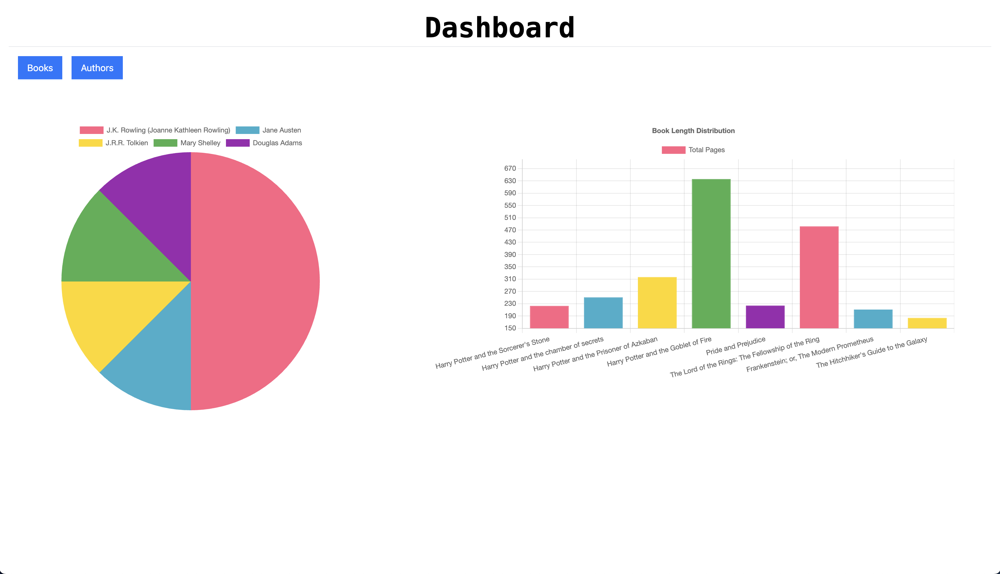
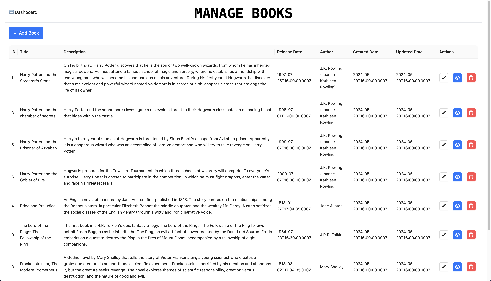
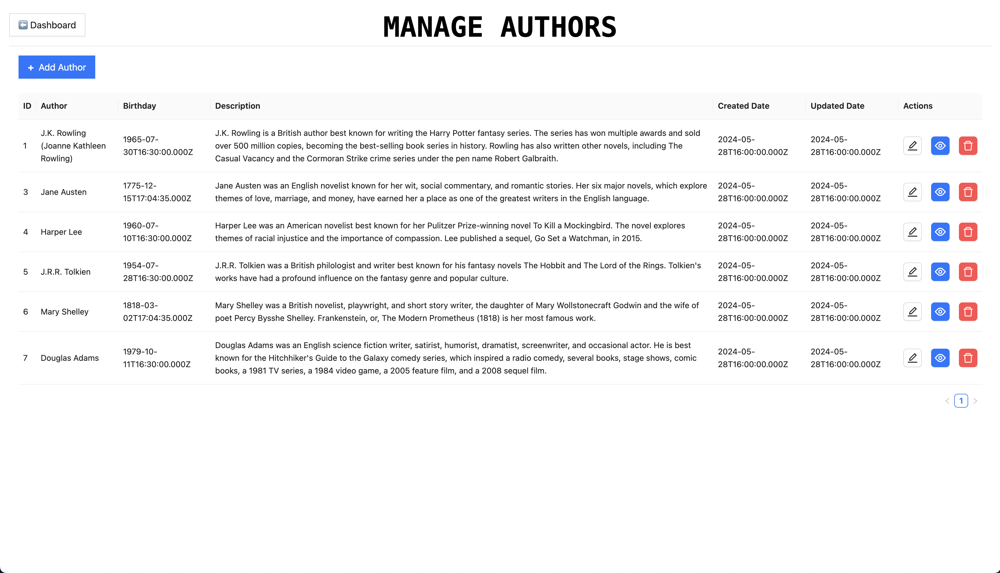

# Full Stack Web Application — ReactJS, NodeJS & MySQL

A full-stack web application built using **ReactJS**, **NodeJS (Express)**, and **MySQL**, deployed on **AWS** using a **3-Tier Architecture**. This branch (`feature/add-logging`) includes **application-level logging** with **CloudWatch** integration for monitoring.

> 🔗 **Live Demo:** _Coming soon_

---

## 📸 User Interface Screenshots

### Dashboard


### Books


### Authors


---

## 🛠️ Tech Stack

| Layer | Technology |
|-------|------------|
| Frontend | ReactJS + Vite + NGINX |
| Backend | NodeJS + ExpressJS + PM2 |
| Database | MySQL (AWS RDS) |
| Logging | Winston + AWS CloudWatch |
| Cloud | AWS EC2, RDS, ALB, Auto Scaling Group |

---

## 📐 Architecture

This project follows a **3-Tier Architecture** deployed on AWS:

- **Presentation Layer** — ReactJS served via NGINX on public EC2 instances
- **Application Logic Layer** — ExpressJS REST API managed by PM2 on private EC2 instances
- **Data Layer** — MySQL hosted on AWS RDS

---

## 📁 Project Structure

```
react-node-mysql-app/
├── frontend/          # ReactJS + Vite application
│   ├── src/
│   ├── public/
│   ├── .env
│   └── package.json
├── backend/           # NodeJS + Express REST API
│   ├── logs/          # Application log files
│   ├── .env
│   └── package.json
└── README.md
```

---

## 🔐 Connecting to Private EC2 via Bastion Host

```bash
# 1. Change SSH key permission
chmod 400 your_key.pem

# 2. Start SSH agent
eval "$(ssh-agent -s)"

# 3. Add key to SSH agent
ssh-add your_key.pem

# 4. SSH into bastion host with agent forwarding
ssh -A ec2-user@bastion_host_public_ip

# 5. Connect to private instance from bastion host
ssh ec2-user@private_instance_private_ip
```

---

## 🗄️ Setting up the Data Tier (MySQL)

```bash
# Download MySQL repository package
wget https://dev.mysql.com/get/mysql80-community-release-el9-1.noarch.rpm

# Verify the download
ls -lrt

# Install MySQL repository package
sudo dnf install -y mysql80-community-release-el9-1.noarch.rpm

# Import GPG key
sudo rpm --import https://repo.mysql.com/RPM-GPG-KEY-mysql-2023

# Update package index
sudo dnf update -y

# Install MySQL server
sudo dnf install -y mysql-community-server

# Start and enable MySQL
sudo systemctl start mysqld
sudo systemctl enable mysqld

# Secure MySQL installation
sudo grep 'temporary password' /var/log/mysqld.log
sudo mysql_secure_installation
```

> To create the database and restore data, refer to the SQL scripts in `backend/db.sql`

---

## 🔗 Connect to RDS via SSH Tunneling

**Through bastion host only:**
```bash
ssh -i /path/to/your/private-key.pem -N -L 3307:<RDS-Endpoint>:3306 ec2-user@<Bastion-Host-IP>
```

**Through bastion host + private EC2 (SSH chaining):**
```bash
ssh-add /path/to/your/private-key.pem
ssh -A -L 3307:localhost:3306 ec2-user@<public-IP> -t "ssh -L 3306:<rds-endpoint>:3306 ec2-user@<private-IP>"
```

---

## ⚙️ Configure Application Tier (Auto Scaling Group)

```bash
#!/bin/bash
# Update package list and install required packages
sudo yum update -y
sudo yum install -y git

# Install Node.js 18
curl -fsSL https://rpm.nodesource.com/setup_18.x | sudo bash -
sudo yum install -y nodejs

# Install PM2 globally
sudo npm install -g pm2

# Define variables
REPO_URL="https://github.com/YOUR_USERNAME/YOUR_REPO_NAME.git"
BRANCH_NAME="feature/add-logging"
REPO_DIR="/home/ec2-user/react-node-mysql-app/backend"
ENV_FILE="$REPO_DIR/.env"

# Clone the repository
cd /home/ec2-user
sudo -u ec2-user git clone $REPO_URL
cd react-node-mysql-app

# Checkout to the specific branch
sudo -u ec2-user git checkout $BRANCH_NAME
cd backend

# Create log directory
LOG_DIR="/home/ec2-user/react-node-mysql-app/backend/logs"
mkdir -p $LOG_DIR
sudo chown -R ec2-user:ec2-user $LOG_DIR

# Set environment variables
echo "LOG_DIR=$LOG_DIR" >> "$ENV_FILE"
echo "DB_HOST=\"<rds-instance-endpoint>\"" >> "$ENV_FILE"
echo "DB_PORT=\"3306\"" >> "$ENV_FILE"
echo "DB_USER=\"<db-user>\"" >> "$ENV_FILE"
echo "DB_PASSWORD=\"<db-password>\"" >> "$ENV_FILE"
echo "DB_NAME=\"<db-name>\"" >> "$ENV_FILE"

# Install dependencies and start with PM2
sudo -u ec2-user npm install
sudo -u ec2-user npm run serve

# Ensure PM2 restarts on reboot
sudo -u ec2-user pm2 startup systemd
sudo -u ec2-user pm2 save
```

---

## 📊 Enable CloudWatch Logs for Application Tier

```bash
# Install CloudWatch agent
sudo yum install -y amazon-cloudwatch-agent

# Create CloudWatch agent configuration
sudo tee /opt/aws/amazon-cloudwatch-agent/etc/amazon-cloudwatch-agent.json > /dev/null <<EOL
{
  "logs": {
    "logs_collected": {
      "files": {
        "collect_list": [
          {
            "file_path": "/home/ec2-user/react-node-mysql-app/backend/logs/*.log",
            "log_group_name": "backend-node-app-logs",
            "log_stream_name": "{instance_id}",
            "timestamp_format": "%Y-%m-%d %H:%M:%S"
          }
        ]
      }
    }
  }
}
EOL

# Start CloudWatch agent
sudo /opt/aws/amazon-cloudwatch-agent/bin/amazon-cloudwatch-agent-ctl \
  -a fetch-config -m ec2 \
  -c file:/opt/aws/amazon-cloudwatch-agent/etc/amazon-cloudwatch-agent.json -s
```

---

## 🖥️ Configure Presentation Tier (Auto Scaling Group)

```bash
#!/bin/bash
# Update packages and install dependencies
sudo yum update -y
sudo yum install -y git

# Install Node.js 18
curl -fsSL https://rpm.nodesource.com/setup_18.x | sudo bash -
sudo yum install -y nodejs

# Install and start NGINX
sudo yum install -y nginx
sudo systemctl start nginx
sudo systemctl enable nginx

# Define variables
REPO_URL="https://github.com/YOUR_USERNAME/YOUR_REPO_NAME.git"
BRANCH_NAME="feature/add-logging"
REPO_DIR="/home/ec2-user/react-node-mysql-app/frontend"
ENV_FILE="$REPO_DIR/.env"
APP_TIER_ALB_URL="http://<internal-alb-endpoint>"
API_URL="/api"

# Clone repository and checkout branch
cd /home/ec2-user
sudo -u ec2-user git clone $REPO_URL
cd react-node-mysql-app
sudo -u ec2-user git checkout $BRANCH_NAME
cd frontend

sudo chown -R ec2-user:ec2-user /home/ec2-user/react-node-mysql-app

# Set environment and build
echo "VITE_API_URL=\"$API_URL\"" >> "$ENV_FILE"
sudo -u ec2-user npm install
sudo -u ec2-user npm run build

# Copy build to NGINX
sudo cp -r dist /usr/share/nginx/html/
```

#### NGINX Configuration (`/etc/nginx/conf.d/presentation-tier.conf`)

```nginx
server {
    listen 80;
    server_name <your-domain>;
    root /usr/share/nginx/html/dist;
    index index.html index.htm;

    # Health check
    location /health {
        default_type text/html;
        return 200 "<!DOCTYPE html><p>Health check endpoint</p>\n";
    }

    location / {
        try_files $uri /index.html;
    }

    # Reverse proxy to Application Tier ALB
    location /api/ {
        proxy_pass http://<internal-alb-endpoint>;
        proxy_set_header Host $host;
        proxy_set_header X-Real-IP $remote_addr;
        proxy_set_header X-Forwarded-For $proxy_add_x_forwarded_for;
        proxy_set_header X-Forwarded-Proto $scheme;
    }
}
```

```bash
# Restart NGINX to apply config
sudo systemctl restart nginx
```

---

## 🔥 Stress Testing (Auto Scaling Trigger)

```bash
sudo yum install stress -y
stress --cpu 4 --timeout 180s
top
```

---

## 🚀 EC2 User Data Script — Install NGINX (Simple)

For basic EC2 / single AZ setup:

```bash
#!/bin/bash
yum update -y
yum install -y nginx
systemctl stop nginx
systemctl disable nginx
echo "Welcome to Presentation Tier EC2 instance in Availability Zone B." > /usr/share/nginx/html/index.html
systemctl start nginx
systemctl enable nginx
```

For Auto Scaling Group setup (with IMDSv2 instance metadata):

```bash
#!/bin/bash
sudo yum update -y
sudo yum install nginx -y
sudo systemctl start nginx
sudo systemctl enable nginx

TOKEN=$(curl -X PUT "http://169.254.169.254/latest/api/token" -H "X-aws-ec2-metadata-token-ttl-seconds: 21600")
INSTANCE_ID=$(curl -H "X-aws-ec2-metadata-token: $TOKEN" "http://169.254.169.254/latest/meta-data/instance-id")
AVAILABILITY_ZONE=$(curl -H "X-aws-ec2-metadata-token: $TOKEN" "http://169.254.169.254/latest/meta-data/placement/availability-zone")
PUBLIC_IP=$(curl -H "X-aws-ec2-metadata-token: $TOKEN" "http://169.254.169.254/latest/meta-data/public-ipv4")

sudo bash -c "cat > /usr/share/nginx/html/index.html <<EOF
<h1>Instance Details</h1>
<p><b>Instance ID:</b> $INSTANCE_ID</p>
<p><b>Availability Zone:</b> $AVAILABILITY_ZONE</p>
<p><b>Public IP:</b> $PUBLIC_IP</p>
EOF"

sudo systemctl restart nginx
```

---

## 📚 What I Learned

- Designing and deploying a 3-tier architecture on AWS
- Accessing private EC2 instances securely via a Bastion Host
- Setting up MySQL on EC2 and connecting to AWS RDS via SSH tunneling
- Managing Node.js processes with PM2 and auto-restart on reboot
- Application-level logging and streaming logs to AWS CloudWatch
- Building and serving a React (Vite) app with NGINX
- Configuring NGINX reverse proxy to route API calls to the Application Tier ALB
- Setting up Auto Scaling Groups with EC2 User Data scripts
- Stress testing EC2 instances to trigger Auto Scaling policies

---

## 🙏 Acknowledgements

- Original project by [Learn It Right Way](https://github.com/Learn-It-Right-Way/lirw-react-node-mysql-app)
- Branch reference: `feature/add-logging`
- Built as part of my full-stack + AWS learning journey

---

## 📄 License

This project is for educational purposes.


